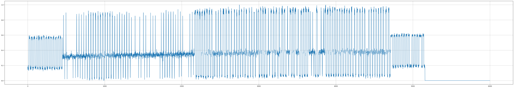

# 代码重构(FM0)

## 编码规则

**Miller4：**

**FM0:**

## 数据格式

旧设备：Miller4编码，包含EPC和RN16数据，单个文件仅包含一个RN16和一个EPC数据

新设备：FM0编码，无EPC数据，单个文件中包含大量的RN16数据

## 数据格式对比

|                      | 旧数据         | 新数据                                           |
| -------------------- | -------------- | ------------------------------------------------ |
| 编码格式             | Miller4        | FM0                                              |
| 采样率               | 8M             | 2M                                               |
| 单个码元采样点个数   | 10，11         | 最小20，最大25                                   |
| 单个解析文件RN16数量 | 1              | 未知                                             |
| 单个解析文件EPC数量  | 1              | 0                                                |
| 有效数据电平         | 高电平有效数据 | 低电平无效数据，高电平无数据，中间部分为有效数据 |

## 数据分片解析

无效数据：

有效数据（RN16发生碰撞）：

## 代码重构

- 源文件读取（无需重构）
- 有效数据提取 （重构）
- 数据分片 （重构）
- 数据转二进制 （重构）
- 二进制数据解码 （重构）
- 解码数据转十六进制 （部分重构）
- ~~特征提取~~
- ~~指纹提取~~
- ~~数据集生成~~
- ~~碰撞数据合成~~
- ~~平滑滤波~~

增加功能：将碰撞数据和正常数据分离

# 神经网络

### 输入数据：

$S_A$: 碰撞源A

$S_B$: 碰撞源B

$S_{noiseH}$: 高频噪声

$S_{noiseL}$: 低频噪声

$Collide$: 发生碰撞

碰撞信号: $S_c =Collide( S_A, S_B, S_{noiseH}, S_{noiseL})$

### Input Layer：减弱噪声

对高频噪声有一定的抑制，低频噪声无明显影响

$S_{c1} = S_c - \gamma S_{noiseH}$

### CNN Block1(节选自部分通道)：

从该Block的中间结果可以看出：这部分的卷积核从各个维度去分析了数据，有的是极大抑制，有的是极小抑制，有的是对上一层输入进一步的减少噪声

### CNN Block2(节选自部分通道)：

从该Block的中间结果可以看出：部分卷积的输出与对信号进行傅里叶变化之后去除过多高频信号得到的信号类似，这部分网络可能做了类似的操作。

### CNN Block3:

### 输出A:

### 输出B：

# 消融实验

消融实验（Ablation Study）是一种科学实验方法，用于确定模型中哪些部分对于完成任务或达到预期效果是必要的。在机器学习和深度学习领域，消融实验通常用来评估模型中不同组件的贡献，例如特征、层、算法或超参数等。通过这种方法，研究人员可以更好地理解模型的工作原理以及哪些因素对模型性能有显著影响。

消融实验的一般步骤如下：

1. **基线模型**：首先建立一个基线模型，这个模型包含了所有你想要测试的组件。

2. **移除组件**：逐一或组合移除模型中的某些组件，每次移除后都形成一个变体模型。

3. **评估影响**：对每个变体模型进行评估，通常是在相同的数据集和评估标准下。

4. **比较结果**：比较基线模型和变体模型的性能，分析移除特定组件对模型性能的影响。

5. **得出结论**：根据实验结果，得出哪些组件对模型性能至关重要，哪些组件可以被省略或替换。

消融实验的关键在于确保除了被消融的部分之外，其他条件保持不变，以便公平地评估单一变量的影响。这种实验设计有助于提高模型的透明度和可解释性，同时也可以帮助研究人员优化模型结构，提高效率。
